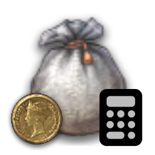
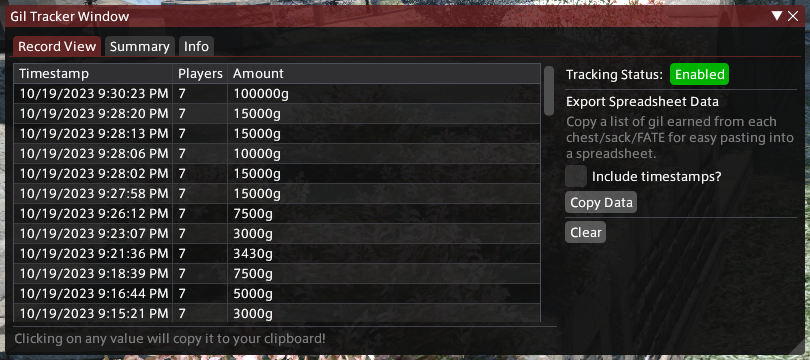
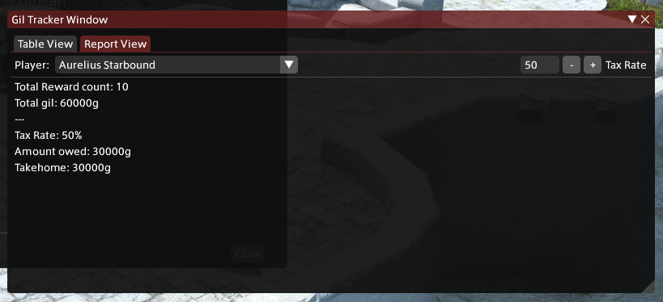

# FFXIV FATE/Map Gil Tracker

This plugin aims to simplify reward tracking for FCs who use FATEs/Maps as fundraising events! Simply install it, enable it, and it'll automatically track every chest or sack opened and calculate how much gil each person owes.

## Screenshots

## Installation / Usage

As of right now, this project is still in a development and testing state and is not ready for publishing on the main plugin repo. For now, you'll have to compile it manually if you want to use it.

1. Clone this repo
2. Install Visual Studio Code 2022 with C# support
3. Open MapGilTracker.sln in VS and build it
4. In Dalamud, open the Plugin Installer settings menu
5. Under the "Experimental" tab, add the full path to the compiled DLL under "Dev Plugin Locations"
6. Profit? 

## Contributions

Sure, I guess? Simply open a PR and I can work with you to merge in whatever features/fixes you want to add.
