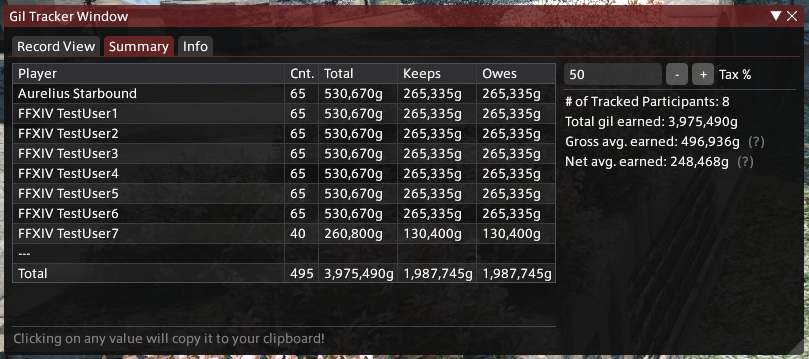

# FFXIV FATE/Map Gil Tracker

[][AzureDalamudRepo]

This plugin aims to simplify reward tracking for FCs who use FATEs/Maps as fundraising events! Simply install it, enable it, and it'll automatically track every chest or sack opened and calculate how much gil each person owes.

## Screenshots

## Installation

This plugin is pending approval for being added to the main Dalamud repo. In the meantime, all builds will be hosted on my personal third-party repo. You can find that repo by clicking [here][AzureDalamudRepo] or on the repo badge above.

[][AzureDalamudRepo]

## Development

In order to set up a development environment to work on this plugin, perform the following steps:

0. Install Visual Studio Code 2022 with C# support
1. Fork this repo to your account, then clone it to your local machine
2. Open MapGilTracker.sln in VS2022 and build it
3. In Dalamud, open the Plugin Installer settings menu
4. Under the "Experimental" tab, add the full path to the compiled debug DLL under "Dev Plugin Locations"
5. Profit? (Heh.)

## Contributions

Sure, I guess? Simply open a PR and I can work with you to merge in whatever features/fixes you want to add.

[AzureDalamudRepo]: https://github.com/Azure-Agst/DalamudRepo
